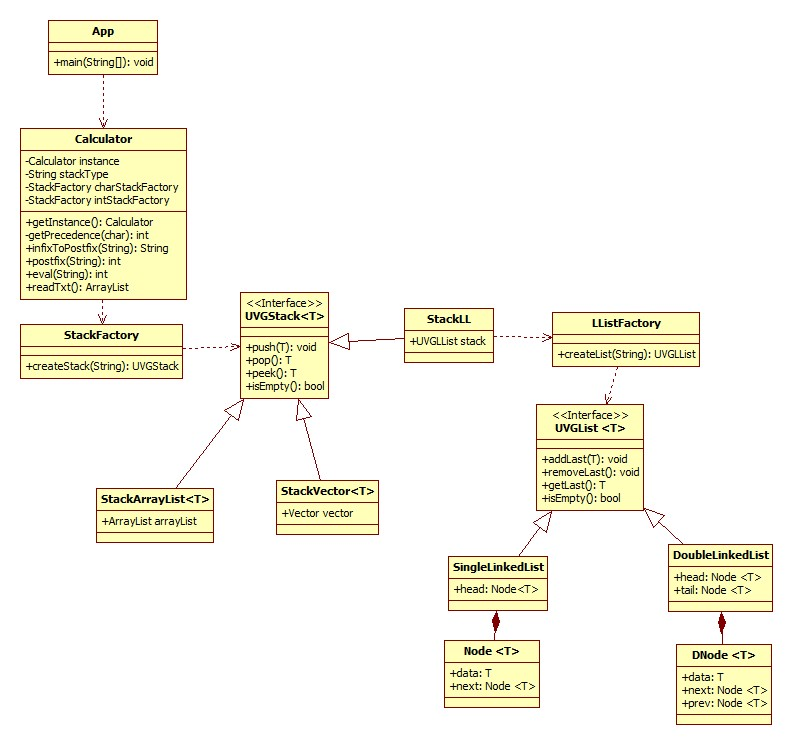

# Hoja de Trabajo 4. Factory, Singleton y Postfix
## Autor: Jose Merida | 26 de Febrero 2024
## Instalación
Este proyecto utiliza [Maven](https://maven.apache.org/) y fue escrito en [Java](https://www.java.com/en/), por lo cual es necesario instalar estas dependencias para poder correr el programa. Para proteger los datos de los usuarios y el acceso a la base de datos, la información de conexión se coordina por medio de variables de entorno, por lo cuál es necesario configurarlas para conectarse a la base de datos de AuraDB con los datos cargados.
### Instrucciones:
Su programa debe realizar el cálculo de una expresión infix, para lograrlo de primero debe convertir la expresión a postfix y
luego evaluarla tal como se realizó en la hoja de trabajo no. 2. Debe leer esa expresión de un archivo de texto llamado
datos.txt.

Por ejemplo, el cálculo de la expresión infix: (1+2)*9
La expresión es evaluada obtendrá como resultado 27

En los anexos de esta hoja de trabajo encontrará el algoritmo necesario para la conversión de una expresión infix a postfix,
para simplificar asuma que los números serán únicamente de un solo dígito.

NOTA: esta hoja implementa varios patrones de diseño. Su programa debe solicitar al usuario que indique la
implementación deseada para el stack (arrayList, vector, lista). Si se desea usar la implementación de stack basada en listas,
entonces también debe solicitar al usuario que indique la implementación de listas a emplear (simplemente encadenada,
doblemente encadenada)

Su programa principal (realizado en la hoja no. 2) debe usar:

a. Patron de diseño Factory: para seleccionar la implementación de la pila a utilizar. Favor notar que si
selecciona una implementación basada en listas, deberá utilizar nuevamente ese patrón para indicar la
implementación de lista a utilizar.

b. Patron de diseño Singlenton: para asegurarse que existe solo una instancia de su clase Calculadora.
Esta es independiente de la GUI que usted utilice.

### Salidas
La entrada de texto se encuentra en el archivo data.txt
```
1+2+4+5
1*2+9
```
Se convierten a postfix
```
12+4+5+
12*9+
```
Y se evaluan, teniendo como salida
```
12
11
```
### Diagrama UML

