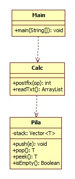

# Hoja de Trabajo 1. Repaso Java / Interfaces
## Autor: Jose Merida | 1 de Febrero 2024
### Instrucciones:
Su programa debe leer de un archivo de texto, una expresión en formato Postfix y producir el resultado de la misma. El archivo
de texto se llama datos.txt y será proporcionado por su auxiliar al correr el programa. En cada línea del archivo de texto
vendrá una expresión en notación postfix, semejante a:

1 2 + 4 * 3 +

Debe implementar una interfaz _pila_ y realizar una implementación utilizando la clase Vector.

### Diagrama UML

