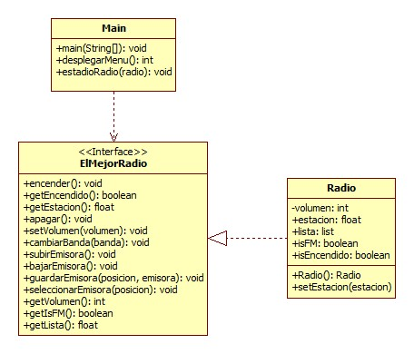

# Hoja de Trabajo 1. Repaso Java / Interfaces
## Autor: Jose Merida | 29 de Agosto 2023
### Instrucciones:
“Design a data structure to simulate the workings of a radio. The state of the radio is on or off, and it may
be used to listen to an AM or FM station. A dozen modifiable push buttons (identified by integers 1
through 12) allow the listener to store and recall AM or FM frequencies. AM frequencies can be
represented by multiples of 10 in the range 530 to 1610. FM frequencies are found at multiples of 0.2 in
the range 87.9 to 107.9.”
### Funcionamiento del Programa
[Video](https://youtu.be/aFteQ6UP1dw?feature=shared)
### Diagrama UML

